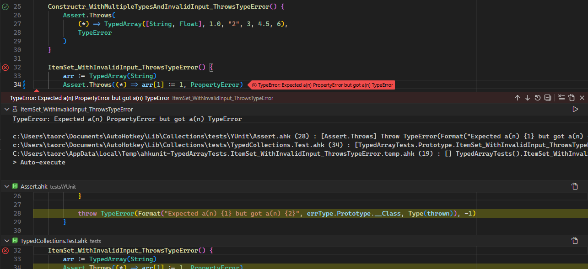
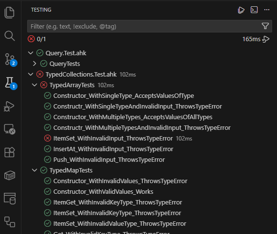
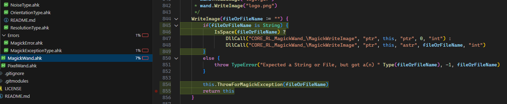

# AHKUnit

A VS Code extension for running AutoHotkey v2 unit tests with full IDE integration. View and run tests in the test explorer, run tests via gutter icons, show detailed failure reports, and easily navigate through callstacks.



### Install
Install for [VSCode](https://marketplace.visualstudio.com/items?itemName=holy-tao.ahkunit) | [OpenVSX](https://open-vsx.org/extension/holy-tao/ahkunit) | from the the [latest GitHub release](https://github.com/holy-tao/ahkunit/releases/latest)

You can install the absolute latest build - which may be unstable - from [GitHub actions](https://github.com/holy-tao/ahkunit/actions/workflows/ci.yml)

## Features

- **Test Explorer Integration**: View and manage all tests in VS Code's Test Explorer sidebar
- **Gutter Icons**: Run individual tests directly from the editor with inline run/debug icons
- **Detailed Failure Reports**: Comprehensive error messages with parsed stack traces for quick debugging
- **Callstack Navigation**: Click through error stacks to jump to the failing line in your code
- **Code Coverage Reports**: View code coverage by test or file
- **Output Capture**: Automatically capture and display stdout/stderr from your tests
- **Hierarchical Organization**: Organize tests into nested class hierarchies for better structure
- **Test Filtering**: Easily run specific tests or entire test suites

## Table of Contents
- [Features](#features)
- [Table of Contents](#table-of-contents)
- [Usage](#usage)
  - [Test Structure](#test-structure)
  - [Test Discovery](#test-discovery)
  - [Code Coverage](#code-coverage)
- [Configuration](#configuration)

## Usage
###  Test Structure

AHKUnit expects tests organized as nested classes with methods as test cases. Classes can be nested at any level to produce a test heirarchy.

```ahk
class StringUtils {
    class Trim {
        LeadingWhitespace_Removed() {
            result := Trim("  hello")
            if (result != "hello")
                throw Error("Expected 'hello', got '" result "'")
        }
        
        TrailingWhitespace_Removed() {
            result := Trim("hello  ")
            if (result != "hello")
                throw Error("Expected 'hello', got '" result "'")
        }
    }
    
    class Split {
        WithDelimiter_ReturnsArray() {
            ; ...
        }
    }
}
```

This produces a test heirarchy in the VSCode [test explorer](https://code.visualstudio.com/docs/debugtest/testing) like so:



#### The Test environment

The runner runs a single test method in isolation on a new instance of the test class. No other methods are invoked directly, though the `__New` and `__Delete` [meta-functions](https://www.autohotkey.com/docs/v2/Objects.htm#Custom_NewDelete) are called as usual. A test method cannot have required arguments, nor can the test class's static `Call` and `__New` methods.

A test passes if it finishes without throwing. A test fails if it throws any kind of [`Error`](https://www.autohotkey.com/docs/v2/lib/Error.htm). The error's stack is parsed and displayed in the failure information.

Tests can optionally log information to [stdout or stderr](https://www.autohotkey.com/docs/v2/lib/FileOpen.htm); this information is displayed along with the test result.

#### Assertions

AHKUnit does not provide a dedicated assertion library. Instead, tests use AutoHotkey's native error handling:

```ahk
TestAddition() {
    result := 2 + 2
    if (result != 4)
        throw Error("Expected 4, got " result)
}
```

The error message will be captured and displayed in the test failure report. You can throw any `Error` object, including custom error types. Use clear, descriptive error messages to make debugging easier.

### Test Discovery

By default, AHKUnit discovers files matching the [glob pattern](https://code.visualstudio.com/docs/editor/glob-patterns) `**/*.test.ahk`. This can be [configured](#configuration) with the `ahkunit.testFileGlob` setting. Place test files alongside your source or in a dedicated `tests/` folder. `#Include`-ed files are not parsed.

AHKUnit scans discovered files for classes and methods to form a heirarchy as described above. 

#### Excluding Classes and Methods
The parser ignores methods starting with `_` (including builtins like `__New` and `__Delete`), which can be used as helpers. Additionally, you can explcitly exclude classes and methods using the `;@ahkunit-ignore` directive. Ignoring a class also ignores all of its methods. Static methods are also ignored.

```autohotkey
;@ahkunit-ignore
UtilityClass {
    InstanceMethod() {

    }
}

TestClass {
    TestMethod() {
        this.UtilityMethod()
        Assert(something)
    }

    ;@ahkunit-ignore
    UtilityMethod() {

    }
}
```

### Code Coverage

Run a test with code coverage by right-clicking the gutter icon for the test or test group you want to run and selecting "Run with Coverage", or by selecting the "Run Tests with Coverage" option from the testing pane.



Coverage is calculated by parsing the output of [`ListLines`](https://www.autohotkey.com/docs/v2/lib/ListLines.htm) by way of [`ScriptInfo`](https://www.autohotkey.com/boards/viewtopic.php?t=9656) (credit to [Lexikos](https://github.com/lexikos) and [Descolada](https://github.com/descolada)). This approach has a few quirks and caveats:
  - If your test case is very long and executes more than ~500 lines, the output may be incomplete. Consider writing shorter, more targeted test cases if this becomes a problem.
  - A "line" as determined by the AHK interpreter is not necessarily a single line of source code. For example, a single [ternary](https://www.autohotkey.com/docs/v2/Variables.htm#ternary) expression is treated as one logical line by the interpreter, even if it's spread out over multiple lines in source code:
    ```autohotkey
    ; This appears as one line and only the first line will be highlighted
    condition ? 
        VeryLongStatementOne("param", "param", "param", "param", "param") : 
        VeryLongStatementTwo("param", "param", "param", "param", "param")
    ```
    You can see this in the screenshot above - both `DllCall`s are considered to be on line 845. Other examples of this include function definitions with arguments on multiple lines and most continuation sections.
  - If the code under tests sets `ListLines` to false, the report will be incomplete. 
  
You shouldn't rely on code coverage numbers, but it's a useful tool for discovering what, if anything, [definitely isn't being tested](https://martinfowler.com/bliki/TestCoverage.html).

## Configuration

| Setting | Default | Description |
|---------|---------|-------------|
| `ahkunit.executablePath` | `C:\Program Files\AutoHotkey\v2\AutoHotkey64.exe` | Path to AutoHotkey v2 executable |
| `ahkunit.testFileGlob` | `**/*.test.ahk` | [Glob pattern](https://code.visualstudio.com/docs/editor/glob-patterns) used to identify test files |
